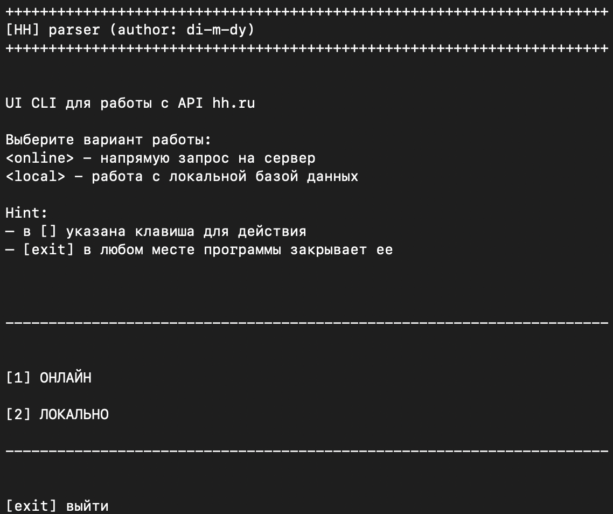

# HH API PARSER

## Description
Парсер вакансий с hh.ru. Позволяет получить информацию о вакансиях с платформы hh.ru в России, сохранять ее в файл и позволяет удобно работать с ней: добавлять, фильтровать, удалять.
## Features
- Получение информации о вакансиях с hh.ru
- Полуение информации о работодателях
- Возможность фильтрации и сортировки вакансий
- Сохранение информации в базу данных
- Взаимодействие с пользователем через консоль
## Architecture
### Модуль [api_parser](src/api_parser.py)
Базовый модуль для работы с API разных платформ.
При желании можно добавить поддержку других платформ.
- Класс `Api` - абстрактный класс для работы с API в котором описан интерфейс
- Класс `ApiBase` - базовый класс для работы с API
- Класс `ApiFindBase` - базовый класс для поиска данных, метод `find` возвращает список
- Класс `ApiInfoBase` - базовый класс для получения информации об объекте
- Класс `JobObjectBase` - базовый класс для объектов необходимых для работы с API
- Класс `GenerateObjectsList` - базовый класс для генерации объектов из данных API

### Модуль [hh_api_parser](src/hh_parser.py)
Модуль для работы с API hh.ru.
- Класс `HHFindVacancy` - класс для поиска вакансий на hh.ru

  - Для более удобного поиска и фильтрации запроса можно использовать следующие **аргументы**:

      - per_page: integer <= 100, Количество элементов на странице
      - page: integer, Количество страниц
      - text: string, Текст поиска
      - search_field: string, Поиск по полям (если не указано, то по всем полям)
      - employment: string, Тип занятости (по id - https://api.hh.ru/dictionaries)
      - schedule: string, График работы (по id - https://api.hh.ru/dictionaries)
      - area: string, Локация (по id - https://api.hh.ru/areas)
      - industry: string, Отрасль (по id - https://api.hh.ru/dictionaries)
      - employer_id: string, Id работодателя
      - currency: string, Валюта (по id - https://api.hh.ru/dictionaries)
      - salary: string, Зарплата
      - label: string, Метка (по id - https://api.hh.ru/dictionaries)
      - only_with_salary: boolean, Только с зарплатой
      - period: integer, Период публикации вакансии
      - date_from: string, Дата, ограничивающая диапазон дат публикации вакансий снизу
      - date_to: string, Дата, ограничивающая диапазон дат публикации вакансий сверху
      - top_lat: float, Верхняя широта границы. В адресе вакансии используется.
      - bottom_lat: float, Нижняя широта границы. В адресе вакансии используется.
      - left_lng: float, Левая долгота границы. В адресе вакансии используется.
      - right_lng: float, Правая долгота границы. В адресе вакансии используется.
      - order_by: string, Сортировка (по id - https://api.hh.ru/dictionaries)
      - sort_point_lat: float, Для сортировки по удаленности - широта
      - sort_point_lng: float, Для сортировки по удаленности - долгота
      - clusters: boolean, Кластеры
      - describe_arguments: boolean, Описывать аргументы, которые используются в запросе
      - no_magic: boolean,
      - premium: boolean, Премиум вакансии
      - responses_count_enabled: boolean, Количество откликов
      - part_time: string, Частичная занятость
      - accept_temporary: boolean, Принимаются временные вакансии
      - locale: string, Локализация
      - host: string, Хост

    _При пустом запросе возвращает все вакансии_

  - **Метод** `find` возвращает список словарей с информацией о вакансиях

- Класс `HHFindEmployer` - класс для поиска работодателей на hh.ru

  - Для более удобного поиска и фильтрации запроса можно использовать следующие **аргументы**:

      - per_page: integer <= 100, Количество элементов на странице
      - page: integer, Количество страниц
      - text: string, Текст поиска
      - search_field: string, Поиск по полям (если не указано, то по всем полям)
      - industry: string, Отрасль (по id - https://api.hh.ru/dictionaries)
      - area: string, Локация (по id - https://api.hh.ru/areas)
      - only_with_vacancies: boolean, Только с вакансиями
      - describe_arguments: boolean, Описывать аргументы, которые используются в запросе
      - no_magic: boolean,
      - locale: string, Локализация
      - host: string, Хост

    _При пустом запросе возвращает все работодателей_
  - **Метод** `find` возвращает список словарей с информацией о работодателях

- Класс `HHInfoVacancy` - класс для получения информации о вакансии на hh.ru

  - Принимает в качестве **аргумента** `id`  вакансии
  - **Метод** `info` возвращает словарь с информацией о вакансии

- Класс `HHInfoEmployer` - класс для получения информации о работодателе на hh.ru
  - Принимает в качестве **аргумента** `id` работодателя
  - **Метод** `info` возвращает словарь с информацией о работодателе

**Объекты:**
Все объекты имеют метод `get_dict` который возвращает словарь с атрибутами объекта и метод `create` который создает объект из словаря
  
  - Класс `HHVacancy` - класс для работы с вакансиями
    - Атрибуты:
      - id_: str: id вакансии 
      - name: str: название вакансии
      - created_at: str: дата создания
      - published_at: str: дата публикации
      - alternate_url: str: ссылка на вакансию
      - employer: dict | HHEmployer: Работодатель
      - salary: dict | HHSalary: Зарплата
      - area: dict | None: Локация
      - experience: dict | None: Опыт работы
      - employment: dict | None: Тип занятости
      - schedule: dict | None: График работы
      - description: str | None = None: Описание
  - Класс `HHEmployer` - класс для работы с работодателями
    - Атрибуты:
      - id_: str: id работодателя
      - name: str: название работодателя
      - alternate_url: str: ссылка на работодателя
      - logo_urls: dict: логотип
      - description: str | None = None: Описание
  - Класс `HHSalary` - класс для работы с зарплатой
    - Атрибуты:
      - `from` - минимальная зарплата
      - `to` - максимальная зарплата
      - `currency` - валюта
      - `gross` - налог
  - Класс `HHArea` - класс для работы с локацией
    - Атрибуты:
      - `id_` - id локации
      - `name` - название локации
      - `url` - ссылка на локацию
  - Класс `HHExperience` - класс для работы с опытом работы
    - Атрибуты:
      - `id_` - id опыта работы
      - `name` - название опыта работы
  - Класс `HHSchedule` - класс для работы с графиком работы
    - Атрибуты:
      - `id_` - id графика работы
      - `name` - название графика работы
  - Класс `HHEmployment` - класс для работы с типом занятости
    - Атрибуты:
      - `id_` - id типа занятости
      - `name` - название типа занятости
- Класс `HHGenerateVacanciesList` - класс для генерации объектов вакансий из данных API
  - Метод `generate` возвращает список объектов вакансий
- Класс `HHGenerateEmployersList` - класс для генерации объектов работодателей из данных API
  - Метод `generate` возвращает список объектов работодателей

### Модуль [data_base](src/data_base.py)
Модуль для работы с базой данных. 
Класс
- Класс `BaseDB` - абстрактный класс который описывает интерфейс для работы с базой данных
  - Метод `create_area` - создание таблицы
  - Метод `delete_area` - создание таблицы
  - Метод `check_area_name` - проверка наличия таблицы
  - Метод `check_key_fields` - проверка наличия необходимых полей
  - Метод `add_value` - добавление данных
  - Метод `select_value` - выборка данных
  - Метод `delete_value` - удаление данных
- Класс `JsonDN` временный класс для теста работы модуля и базового класса

Имитирует работу с базой данных в формате JSON, сохраняя данные в файлах - аналог таблиц базы данных

### Модуль [utils](src/utils.py)
Вспомогательный модуль для объединения работы с API и базой данных

### Модуль [user_unterface](src/user_interface.py)
Пример использования вышеописанных модулей для взаимодействия с пользователем через консоль

## REQUIREMENTS
- Python 3.12
- requests
- pytest
- pytest-cov
- requests-mock
- html2text
